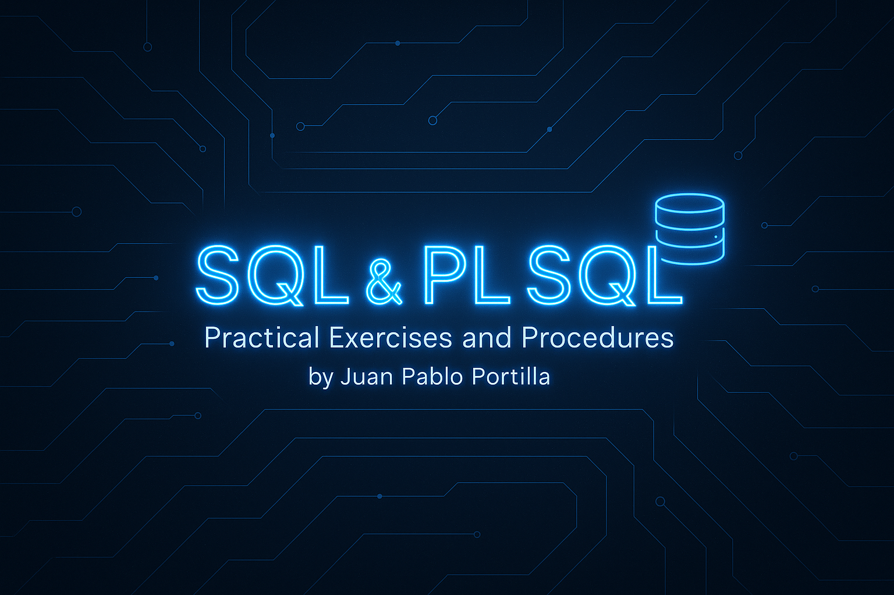

<h1 align="center">SQL and PL/SQL Practice Scripts Repository</h1>

  A curated collection of academic and practical SQL and PL/SQL scripts developed for hands-on learning and practice.
  This includes stored procedures, functions, anonymous blocks, cursors, exception handling, composite data types, and advanced SQL queries.

<h2 id="about">About The Project</h2>

  This repository contains educational SQL and PL/SQL code samples developed during database programming coursework.
  It is structured to demonstrate a wide range of capabilities in Oracle SQL and PL/SQL environments. The material is appropriate for students,
  professionals, and anyone looking to reinforce their knowledge of:

<ul>
  <li><strong>SQL Querying Fundamentals</strong>: Selection, filtering, ordering, aggregation, subqueries</li>
  <li><strong>Joins and Multi-table Operations</strong>: INNER JOIN, OUTER JOIN, multi-table queries</li>
  <li><strong>Grouping and Aggregations</strong>: GROUP BY, HAVING, aggregate functions</li>
  <li><strong>Stored Procedures and Functions</strong></li>
  <li><strong>Anonymous Blocks</strong></li>
  <li><strong>Exception Handling</strong></li>
  <li><strong>Bulk Collect and Records</strong></li>
  <li><strong>Cursors (Explicit and Implicit)</strong></li>
  <li><strong>Parameterized Logic and Control Structures</strong></li>
</ul>

  All scripts follow Oracle SQL and PL/SQL standards and are meant for demonstration, educational, and academic use.

  <h3>Built With</h3>
  
  
  

<h2 id="structure">Repository Structure</h2>
<ul>
  <li><strong>/scripts</strong>: All SQL/PLSQL source files including procedures, queries, and test cases</li>
  <li><strong>/diagrams</strong>: Optional ER diagrams or logical schema references</li>
  <li><strong>README.md</strong>: Project overview and usage instructions</li>
</ul>

<h2 id="installation">How To Use</h2>
<ol>
  <li>Clone the repository:
    <pre><code>git clone https://github.com/PortillaXpert/SQL-AND-PL-SQL.git</code></pre>
  </li>
  <li>Connect to your Oracle SQL environment (SQL Developer or SQL*Plus)</li>
  <li>Run the scripts in the following recommended order:
    <ul>
      <li>01_tables_and_inserts.sql</li>
      <li>02_sql_queries_and_joins.sql</li>
      <li>03_stored_procedures.sql</li>
      <li>04_functions_and_blocks.sql</li>
      <li>05_bulk_collect_and_records.sql</li>
      <li>06_cursors_and_outputs.sql</li>
    </ul>
  </li>
  <li>Enable output if required:
    <pre><code>SET SERVEROUTPUT ON;</code></pre>
  </li>
</ol>

<h2 id="examples">Examples Included</h2>
<ul>
  <li>Compare average salaries between two departments (Function + Anonymous Block)</li>
  <li>Find employee with the lowest salary in a department (Stored Procedure)</li>
  <li>Determine department with highest total salary (Stored Procedure)</li>
  <li>Insert or update employee data conditionally (Upsert logic)</li>
  <li>Delete products using custom procedures</li>
  <li>Use of <code>Bulk Collect</code> into record collections</li>
  <li>Hierarchical reporting using explicit cursors (e.g., employee and boss names)</li>
  <li>Advanced SQL queries including multi-table joins and aggregations</li>
</ul>

<h2 id="contributing">Contributing</h2>

Contributions are welcome! To contribute:

<ol>
  <li>Fork the repository</li>
  <li>Create a new branch:
    <pre><code>git checkout -b feature/YourFeature</code></pre>
  </li>
  <li>Make your changes and commit:
    <pre><code>git commit -m "Add your message here"</code></pre>
  </li>
  <li>Push your branch:
    <pre><code>git push origin feature/YourFeature</code></pre>
  </li>
  <li>Open a Pull Request</li>
</ol>

<h2 id="license">License</h2>

This project is licensed under the MIT License. See the <code>LICENSE.txt</code> file for details.

<h2 id="contact">Contact</h2>

  Created by <a href="https://github.com/PortillaXpert" target="_blank" rel="noopener noreferrer">Juan Pablo Rivera Portilla</a> 
  Email: <a href="mailto:jrivera082002@gmail.com">jrivera082002@gmail.com</a>

  (<a href="#readme-top">Back to top</a>)

